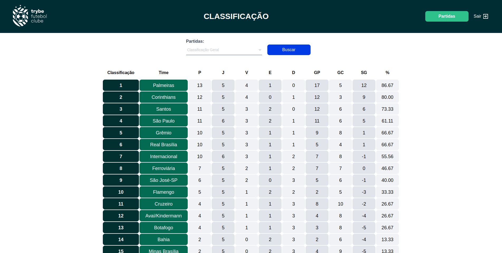

# Trybe Futebol Clube: por dentro de seu campeonato favorito ⚽
<!-- Olá, Tryber!
Esse é apenas um arquivo inicial para o README do seu projeto.
É essencial que você preencha esse documento por conta própria, ok?
Não deixe de usar nossas dicas de escrita de README de projetos, e deixe sua criatividade brilhar!
:warning: IMPORTANTE: você precisa deixar nítido:
- quais arquivos/pastas foram desenvolvidos por você; 
- quais arquivos/pastas foram desenvolvidos por outra pessoa estudante;
- quais arquivos/pastas foram desenvolvidos pela Trybe.
-->
**Trybe Futebol Clube** é uma aplicação que permite ao usuário acompanhar todas as partidas da Série A do Campeonato Brasileiro de Futebol e, caso seja um administrador, também é possível alterar o placar e status de uma partida, assim como criar uma nova!

A aplicação no total possui três bancos de dados: um com os **times**, outro com  as **partidas** e um último para os **usuários**.

Os bancos de dados dos times e partidas são utilizados como base para gerar as informações fundamentais da tabela de classificação e podem ser atualizados pelos administradores diretamente pelo site. Nessa mesma tabela, é possível filtrar a classificação dos times por partidas como mandantes ou visitantes, contabilizando apenas os jogos que cumprem essa restrição.

O banco com os usuários do site possui seus detalhes sensíveis criptografados para uma segurança completa e confiável. Ainda nesse banco, pode-se diferenciar usuários comuns (user) de administradores (admin), onde o administrador possui funcionalidades exclusivas. Por fim, sempre é realizada corretamente a validação do cliente através do token de autenticação, gerado ao fazer login.

<strong>🛠 Detalhes técnicos</strong>
 

  Essa aplicação foi realizada a partir de um projeto do curso de Desenvolvimento Web Full Stack da Trybe, no módulo de Back-End, durante dez dias. O código presente na pasta de front-end foi criado e desenvolvido pela própria organização, enquanto o da pasta de back-end é majoritariamente de autoria própria.

  As competências mais notáveis do website são:

  - Javascript;
  - Typescript;
  - Node.js;
  - POO;
  - Docker;
  - MySQL;
  - JSON Web Token (JWT);
  - Bcrypt;
  - Sinon;
  - Chai HTTP;
  - Test Driven Development (TDD).

<strong>💻 Teste a aplicação!</strong>
 

Caso queira rodar a aplicação localmente, basta utilizar o script `npm run compose:up` e, após os containers serem construídos, acessar a url `http://localhost:3000/leaderboard` em seu navegador.

> [!IMPORTANT]
> Após testar a aplicação, utilize o script `npm run compose:down` para encerrar o docker-compose completamente.
